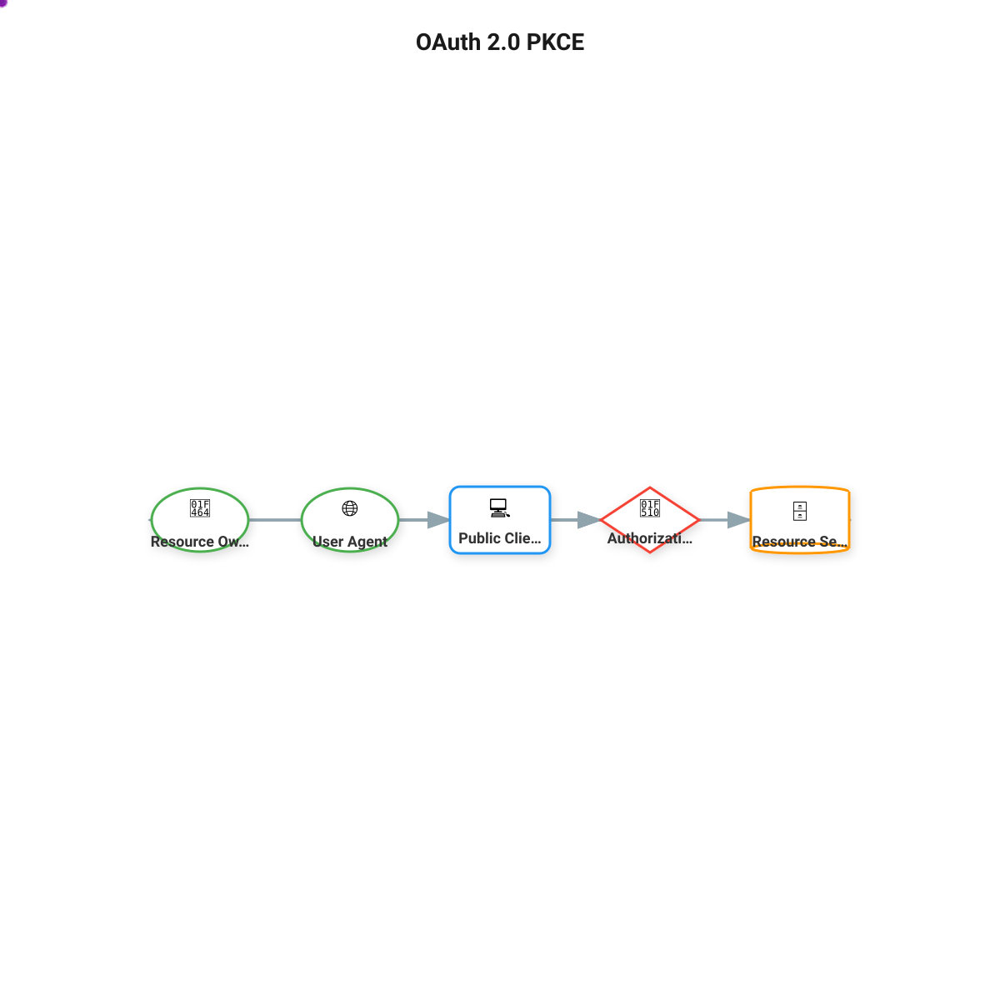
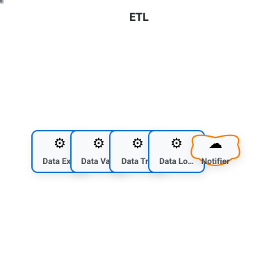
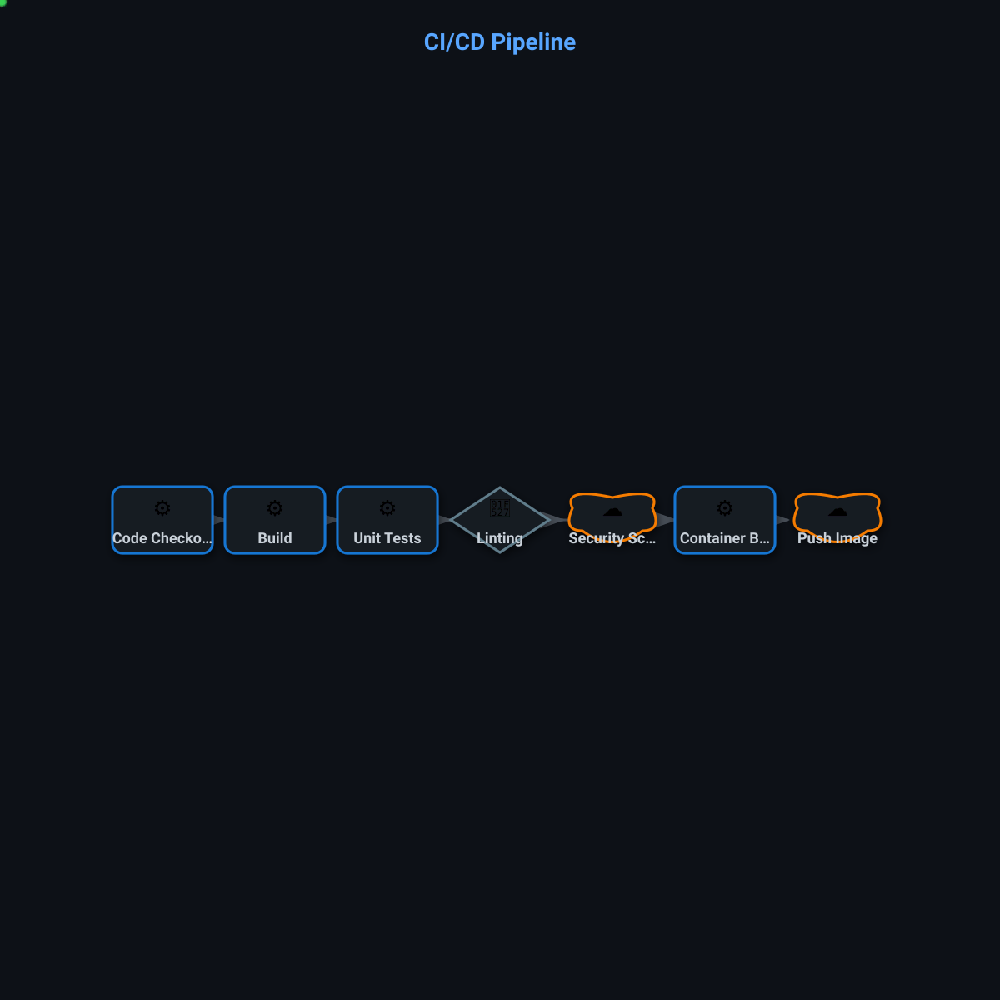
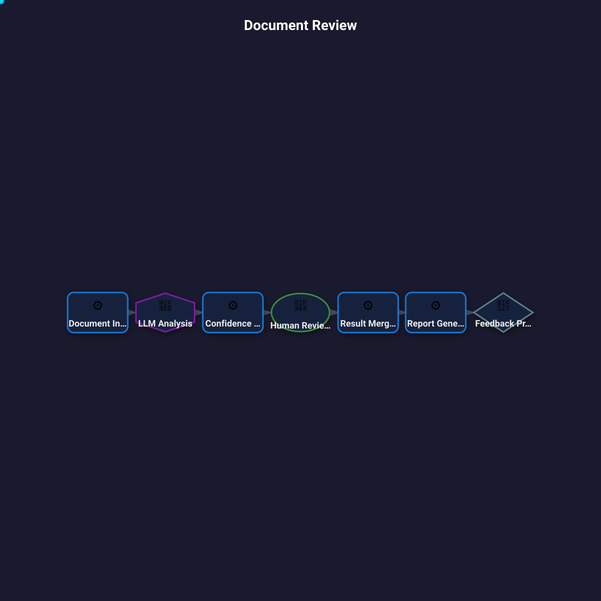
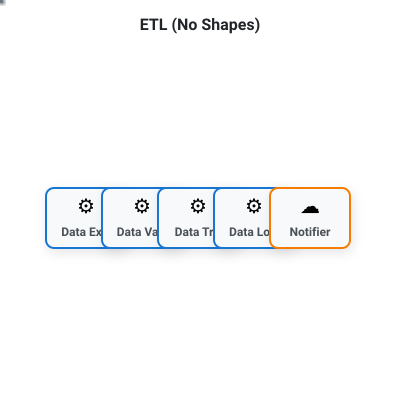

# Infographic Examples

PIDL can generate compact, visually appealing infographics optimized for social media (LinkedIn) and datasheets.

## Generated Examples

### OAuth 2.0 PKCE (LinkedIn Square)

```bash
pidl generate -f infographic --ig-size=linkedin-square --ig-title="OAuth 2.0 PKCE" oauth2_pkce
```



Features:

- Entity type shapes: circle for user, diamond for auth server, cylinder for resource server
- Entity type colors matching the entity roles
- Animated dots showing the flow of data

### ETL Pipeline (Datasheet Tile)

```bash
pidl generate -f infographic --ig-size=datasheet-tile --ig-theme=minimal --ig-title="ETL" etl_pipeline.json
```



Features:

- Compact 400x400 size for datasheet grids
- Minimal theme with subtle colors
- Step type icons (gear for deterministic, cloud for external)

### CI/CD Pipeline (Tech Theme)

```bash
pidl generate -f infographic --ig-size=linkedin-square --ig-theme=tech --ig-title="CI/CD Pipeline" ci_cd_pipeline.json
```



Features:

- Tech theme with dark background and green accent dots
- Step type shapes: rectangles for deterministic, diamonds for tools, clouds for external
- Process flow visualization

### Document Review (Dark Theme)

```bash
pidl generate -f infographic --ig-size=linkedin-square --ig-theme=dark --ig-title="Document Review" llm_document_review.json
```



Features:

- Dark theme optimized for dark mode displays
- Hexagon shape for LLM steps, circle for human review
- Cyan animated dots for visibility on dark background

### ETL Pipeline (No Custom Shapes)

```bash
pidl generate -f infographic --ig-size=datasheet-tile --ig-theme=minimal --ig-title="ETL" --ig-no-shapes etl_pipeline.json
```



Features:

- All nodes rendered as rectangles with `--ig-no-shapes` flag
- Step type colors still applied
- Icons still differentiate step types

## CLI Options

| Option | Description | Default |
|--------|-------------|---------|
| `--ig-size` | Size preset | `linkedin-square` |
| `--ig-theme` | Color theme | `bold` |
| `--ig-title` | Title text | Protocol name |
| `--ig-no-animate` | Disable animated dots | `false` |
| `--ig-no-shapes` | Use rectangles for all nodes | `false` |

### Size Presets

| Size | Dimensions | Use Case |
|------|------------|----------|
| `linkedin-square` | 1200x1200 | LinkedIn feed posts |
| `linkedin-portrait` | 1080x1350 | LinkedIn portrait posts |
| `linkedin-landscape` | 1200x627 | LinkedIn link previews |
| `datasheet-tile` | 400x400 | Datasheet grid layouts |
| `datasheet-wide` | 600x300 | Wide datasheet tiles |

### Themes

| Theme | Description |
|-------|-------------|
| `bold` | High contrast, saturated (default) |
| `minimal` | Clean, subtle |
| `dark` | Dark background |
| `tech` | Tech/engineering feel |

## Node Shapes

When `--ig-no-shapes` is not set, nodes are rendered with shapes based on their type:

### Step Types (Process Specs)

| Step Type | Shape | Icon |
|-----------|-------|------|
| `deterministic` | Rectangle | :gear: |
| `llm` | Hexagon | :brain: |
| `human` | Circle | :bust_in_silhouette: |
| `external` | Cloud | :cloud: |
| `tool` | Diamond | :wrench: |

### Entity Types (Regular Protocols)

| Entity Type | Shape | Icon |
|-------------|-------|------|
| `user`, `browser` | Circle | :bust_in_silhouette: / :globe_with_meridians: |
| `agent`, `delegated_agent` | Hexagon | :robot: / :handshake: |
| `resource_server` | Cylinder | :file_cabinet: |
| `authorization_server`, `identity_provider` | Diamond | :closed_lock_with_key: / :identification_card: |
| `client`, `server` | Rectangle | :computer: / :desktop_computer: |

## Tips

1. **LinkedIn posts**: Use `linkedin-square` (1200x1200) for maximum visibility in feeds
2. **Link previews**: Use `linkedin-landscape` (1200x627) for shared links
3. **Datasheets**: Use `datasheet-tile` (400x400) for grid layouts
4. **Dark mode**: Use `tech` or `dark` themes for dark UI contexts
5. **Presentations**: Use `--ig-no-animate` for static images in slides
6. **Accessibility**: Use `bold` theme for maximum contrast
