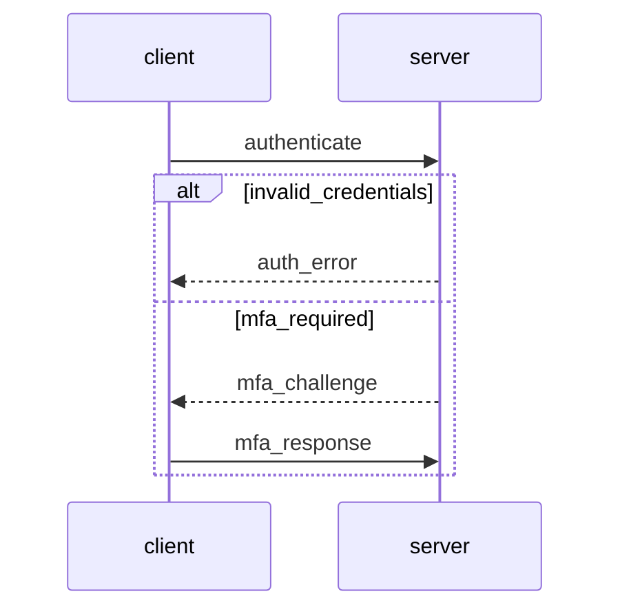

# Alternatives

Alternatives define branching paths from a flow point, rendered as `alt/else` blocks in sequence diagrams.

## Definition

```json
{
  "from": "client",
  "to": "server",
  "action": "authenticate",
  "alternatives": [
    {
      "condition": "invalid_credentials",
      "description": "Authentication failed",
      "flows": [
        {"from": "server", "to": "client", "action": "auth_error", "mode": "response"}
      ]
    },
    {
      "condition": "mfa_required",
      "description": "Multi-factor authentication needed",
      "flows": [
        {"from": "server", "to": "client", "action": "mfa_challenge", "mode": "response"},
        {"from": "client", "to": "server", "action": "mfa_response", "mode": "request"}
      ]
    }
  ]
}
```

## Alternative Fields

| Field | Type | Required | Description |
|-------|------|----------|-------------|
| `condition` | string | Yes | Condition that triggers this path |
| `flows` | array | Yes | Flows in this alternative path (min 1) |
| `description` | string | No | Description of this alternative |

## Diagram Rendering

### Mermaid



### PlantUML

```
client -> server: authenticate
alt invalid_credentials
    server --> client: auth_error
else mfa_required
    server --> client: mfa_challenge
    client -> server: mfa_response
end
```

## Error Handling Pattern

Common pattern for request/response with error handling:

```json
{
  "flows": [
    {
      "from": "client",
      "to": "server",
      "action": "request",
      "alternatives": [
        {
          "condition": "error",
          "flows": [
            {"from": "server", "to": "client", "action": "error_response", "mode": "response"}
          ]
        }
      ]
    },
    {"from": "server", "to": "client", "action": "success_response", "mode": "response"}
  ]
}
```

## Nested Flows

Alternative flows can include all flow features:

```json
{
  "alternatives": [
    {
      "condition": "retry_needed",
      "flows": [
        {
          "from": "client",
          "to": "server",
          "action": "retry",
          "note": "Exponential backoff",
          "annotations": [
            {"type": "performance", "text": "Max 3 retries"}
          ]
        }
      ]
    }
  ]
}
```

## Validation

Alternative flows are validated:

- Condition is required
- At least one flow is required
- Entity references must be valid
- Phase references must be valid (if specified)

## Helper Methods (Go)

```go
// Check if flow has alternatives
if flow.HasAlternatives() {
    for _, alt := range flow.Alternatives {
        fmt.Printf("Alternative: %s (%d flows)\n", alt.Condition, len(alt.Flows))
    }
}
```

## vs Condition

| Feature | `condition` | `alternatives` |
|---------|-------------|----------------|
| Purpose | Single conditional flow | Multiple branching paths |
| Rendering | `opt` block | `alt/else` blocks |
| Flows | Current flow only | Nested flow arrays |

Use `condition` for "execute this flow if X". Use `alternatives` for "branch to different paths based on conditions".
