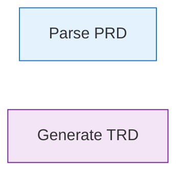

# Process Spec Profile - Technical Requirements Document

**Feature**: Process Spec Profile for PIDL
**Version**: 1.0
**Status**: Draft

## Overview

This document describes the technical design for adding Process Spec profile support to PIDL. The design extends existing types and renderers while maintaining full backward compatibility.

## Architecture

### Design Principles

1. **Profile as extension** - Process Spec adds fields to existing types, not parallel hierarchies
2. **Graceful degradation** - Process-specific fields are ignored by protocol-focused tooling
3. **Shared rendering** - Same renderer interface, enhanced output for process semantics
4. **Incremental adoption** - Users can add process fields to existing protocol specs

### System Components

```
┌─────────────────────────────────────────────────────────────┐
│                        PIDL Core                            │
├─────────────────────────────────────────────────────────────┤
│  types.go          │ Protocol, Entity, Flow + Process fields│
│  parse.go          │ JSON parsing (unchanged)               │
│  validate.go       │ + Process-specific validation          │
│  validate_process.go │ Dependency graph validation          │
├─────────────────────────────────────────────────────────────┤
│                       Renderers                             │
├─────────────────────────────────────────────────────────────┤
│  render/plantuml.go  │ + Process node styling               │
│  render/mermaid.go   │ + Process node styling               │
│  render/d2.go        │ + Process node styling               │
│  render/svg.go       │ + Process icons/colors               │
├─────────────────────────────────────────────────────────────┤
│                      Analysis                               │
├─────────────────────────────────────────────────────────────┤
│  analyze/security.go │ + LLM step detection rules           │
│  execute.go          │ + Input/output tracking              │
└─────────────────────────────────────────────────────────────┘
```

## Data Model

### Protocol Kind Extension

Add to `types.go`:

```go
// ProtocolKind identifies the PIDL profile type.
type ProtocolKind string

const (
    // ProtocolKindProtocol is the default for protocol choreography.
    ProtocolKindProtocol ProtocolKind = "protocol"
    // ProtocolKindProcess is for workflow/process specifications.
    ProtocolKindProcess ProtocolKind = "process"
)
```

Extend `ProtocolMeta`:

```go
type ProtocolMeta struct {
    // ... existing fields ...

    // Kind identifies the PIDL profile type.
    Kind ProtocolKind `json:"kind,omitempty"`
}
```

### Process Step Types

```go
// StepType classifies the processing nature of a step.
type StepType string

const (
    // StepTypeDeterministic is for repeatable, predictable processing.
    StepTypeDeterministic StepType = "deterministic"
    // StepTypeLLM is for LLM/AI-powered non-deterministic processing.
    StepTypeLLM StepType = "llm"
    // StepTypeHuman is for human-in-the-loop steps.
    StepTypeHuman StepType = "human"
    // StepTypeExternal is for external API/service calls.
    StepTypeExternal StepType = "external"
    // StepTypeTool is for tool invocations (MCP-style).
    StepTypeTool StepType = "tool"
)
```

### Entity Extensions for Process

Extend `Entity` with optional process fields:

```go
type Entity struct {
    // ... existing fields ...

    // StepType classifies the processing nature (process profile).
    StepType StepType `json:"step_type,omitempty"`

    // Inputs defines input specifications (process profile).
    Inputs []DataPort `json:"inputs,omitempty"`

    // Outputs defines output specifications (process profile).
    Outputs []DataPort `json:"outputs,omitempty"`

    // Processing configures step execution (process profile).
    Processing *ProcessingConfig `json:"processing,omitempty"`

    // FailureModes lists possible failure scenarios (process profile).
    FailureModes []FailureMode `json:"failure_modes,omitempty"`

    // RetryStrategy configures retry behavior (process profile).
    RetryStrategy *RetryStrategy `json:"retry_strategy,omitempty"`
}
```

### Data Port (Input/Output)

```go
// DataPort represents an input or output of a process step.
type DataPort struct {
    // Kind classifies the data type.
    Kind DataPortKind `json:"kind"`

    // Name is the identifier for this port.
    Name string `json:"name"`

    // Description provides additional context.
    Description string `json:"description,omitempty"`

    // Schema is an optional reference to a JSON Schema.
    Schema string `json:"schema,omitempty"`

    // Required indicates if this input must be provided.
    Required bool `json:"required,omitempty"`

    // Sensitive marks data as containing PII or secrets.
    Sensitive bool `json:"sensitive,omitempty"`
}

// DataPortKind classifies the type of data port.
type DataPortKind string

const (
    DataPortKindFile     DataPortKind = "file"
    DataPortKindObject   DataPortKind = "object"
    DataPortKindAPI      DataPortKind = "api"
    DataPortKindDatabase DataPortKind = "database"
    DataPortKindQueue    DataPortKind = "queue"
    DataPortKindStream   DataPortKind = "stream"
)
```

### Processing Configuration

```go
// ProcessingConfig describes how a step processes its inputs.
type ProcessingConfig struct {
    // Engine identifies the processing engine.
    Engine string `json:"engine,omitempty"`

    // Determinism indicates processing predictability.
    Determinism Determinism `json:"determinism,omitempty"`

    // ModelPolicy specifies model selection for LLM steps.
    ModelPolicy string `json:"model_policy,omitempty"`

    // Timeout is the maximum processing duration.
    Timeout string `json:"timeout,omitempty"`

    // Idempotent indicates if repeated execution is safe.
    Idempotent bool `json:"idempotent,omitempty"`

    // Cacheable indicates if outputs can be cached.
    Cacheable bool `json:"cacheable,omitempty"`

    // CacheTTL is the cache time-to-live if cacheable.
    CacheTTL string `json:"cache_ttl,omitempty"`
}

// Determinism classifies processing predictability.
type Determinism string

const (
    DeterminismDeterministic    Determinism = "deterministic"
    DeterminismNonDeterministic Determinism = "non_deterministic"
)
```

### Failure Modes

```go
// FailureMode describes a possible failure scenario.
type FailureMode struct {
    // ID is the unique identifier for this failure mode.
    ID string `json:"id"`

    // Name is the human-readable name.
    Name string `json:"name"`

    // Description explains the failure scenario.
    Description string `json:"description,omitempty"`

    // Severity indicates the impact level.
    Severity string `json:"severity,omitempty"`

    // Recovery describes how to handle this failure.
    Recovery string `json:"recovery,omitempty"`
}
```

### Retry Strategy

```go
// RetryStrategy configures retry behavior for a step.
type RetryStrategy struct {
    // MaxAttempts is the maximum number of retry attempts.
    MaxAttempts int `json:"max_attempts,omitempty"`

    // InitialDelay is the delay before the first retry.
    InitialDelay string `json:"initial_delay,omitempty"`

    // MaxDelay is the maximum delay between retries.
    MaxDelay string `json:"max_delay,omitempty"`

    // BackoffMultiplier increases delay between retries.
    BackoffMultiplier float64 `json:"backoff_multiplier,omitempty"`

    // RetryOn lists failure mode IDs that trigger retry.
    RetryOn []string `json:"retry_on,omitempty"`
}
```

## Validation

### New Validation Rules

Add `validate_process.go`:

```go
// ValidateProcess performs process-specific validation.
func (p *Protocol) ValidateProcess() ValidationErrors {
    var errs ValidationErrors

    if p.ProtocolMeta.Kind != ProtocolKindProcess {
        return errs // Skip for non-process specs
    }

    // VP001: Validate input/output connectivity
    errs = append(errs, p.validateDataFlow()...)

    // VP002: Detect circular dependencies
    errs = append(errs, p.validateNoCycles()...)

    // VP003: Required inputs must have producers
    errs = append(errs, p.validateRequiredInputs()...)

    // VP004: StepType consistency
    errs = append(errs, p.validateStepTypes()...)

    return errs
}
```

### Validation Error Codes

| Code | Description |
|------|-------------|
| VP001 | Disconnected data port (input has no producer, output has no consumer) |
| VP002 | Circular dependency detected in data flow |
| VP003 | Required input has no producing flow |
| VP004 | Invalid step type for entity type combination |
| VP005 | LLM step missing model_policy |
| VP006 | Retry strategy references unknown failure mode |

## Rendering

### Visual Differentiation

| Step Type | PlantUML | Mermaid | SVG |
|-----------|----------|---------|-----|
| `deterministic` | `<<deterministic>>` stereotype | Blue fill | Gear icon |
| `llm` | `<<llm>>` stereotype | Purple fill | Brain icon |
| `human` | `<<human>>` stereotype | Green fill | Person icon |
| `external` | `<<external>>` stereotype | Orange fill | Cloud icon |
| `tool` | `<<tool>>` stereotype | Gray fill | Wrench icon |

### PlantUML Extensions

```plantuml
' Step type stereotypes
skinparam participant {
    BackgroundColor<<deterministic>> #E3F2FD
    BackgroundColor<<llm>> #F3E5F5
    BackgroundColor<<human>> #E8F5E9
    BackgroundColor<<external>> #FFF3E0
}

participant "Parse PRD" as parse <<deterministic>>
participant "Generate TRD" as generate <<llm>>
```

### Mermaid Extensions



### SVG Process Icons

Add to `render/svg/icons.go`:

```go
var processIcons = map[StepType]string{
    StepTypeDeterministic: `<path d="M12 2C6.48 2 2 6.48..."/>`, // Gear
    StepTypeLLM:           `<path d="M12 2a9 9 0 0 0..."/>`,     // Brain
    StepTypeHuman:         `<path d="M12 12c2.21 0 4..."/>`,     // Person
    StepTypeExternal:      `<path d="M19.35 10.04C18..."/>`,     // Cloud
    StepTypeTool:          `<path d="M22.7 19l-9.1-9..."/>`,     // Wrench
}
```

## Security Analysis

### New Security Rules

Add to `analyze/rules.go`:

| Rule | Severity | Description |
|------|----------|-------------|
| SEC011 | Medium | LLM step without output validation |
| SEC012 | High | Sensitive data flows to LLM step |
| SEC013 | Medium | Non-deterministic step in critical path |
| SEC014 | Low | Missing failure mode for external step |
| SEC015 | Medium | Human step without approval timeout |

### Rule Implementation

```go
// SEC011: LLM step without output validation
func checkLLMOutputValidation(p *Protocol) []SecurityRisk {
    var risks []SecurityRisk
    for _, e := range p.Entities {
        if e.StepType == StepTypeLLM {
            if !hasDownstreamValidation(p, e.ID) {
                risks = append(risks, SecurityRisk{
                    Rule:     "SEC011",
                    Severity: SeverityMedium,
                    Entity:   e.ID,
                    Message:  "LLM step output not validated by downstream deterministic step",
                })
            }
        }
    }
    return risks
}
```

## Simulation

### Input/Output Tracking

Extend `ExecutionState`:

```go
type ExecutionState struct {
    // ... existing fields ...

    // AvailableData tracks which data ports have been produced.
    AvailableData map[string]bool

    // PendingSteps tracks steps waiting for inputs.
    PendingSteps []string
}
```

### Execution Logic

```go
func (e *Executor) canExecuteStep(entity *Entity) bool {
    if entity.StepType == "" {
        return true // Not a process step, use default logic
    }

    for _, input := range entity.Inputs {
        if input.Required {
            key := fmt.Sprintf("%s.%s", entity.ID, input.Name)
            if !e.state.AvailableData[key] {
                return false
            }
        }
    }
    return true
}
```

## JSON Schema

### Schema Extensions

Update `schema/pidl.schema.json`:

```json
{
  "definitions": {
    "protocolMeta": {
      "properties": {
        "kind": {
          "type": "string",
          "enum": ["protocol", "process"],
          "default": "protocol",
          "description": "PIDL profile type"
        }
      }
    },
    "entity": {
      "properties": {
        "step_type": {
          "type": "string",
          "enum": ["deterministic", "llm", "human", "external", "tool"],
          "description": "Processing nature of this step (process profile)"
        },
        "inputs": {
          "type": "array",
          "items": { "$ref": "#/definitions/dataPort" },
          "description": "Input specifications (process profile)"
        },
        "outputs": {
          "type": "array",
          "items": { "$ref": "#/definitions/dataPort" },
          "description": "Output specifications (process profile)"
        }
      }
    },
    "dataPort": {
      "type": "object",
      "required": ["kind", "name"],
      "properties": {
        "kind": {
          "type": "string",
          "enum": ["file", "object", "api", "database", "queue", "stream"]
        },
        "name": { "type": "string" },
        "description": { "type": "string" },
        "schema": { "type": "string" },
        "required": { "type": "boolean" },
        "sensitive": { "type": "boolean" }
      }
    }
  }
}
```

## Testing Strategy

### Unit Tests

| Test File | Coverage |
|-----------|----------|
| `validate_process_test.go` | Validation rules VP001-VP006 |
| `render/plantuml_process_test.go` | PlantUML stereotypes |
| `render/mermaid_process_test.go` | Mermaid class styling |
| `render/svg_process_test.go` | SVG icons and colors |
| `analyze/process_test.go` | Security rules SEC011-SEC015 |
| `execute_process_test.go` | Input/output tracking |

### Integration Tests

| Test | Description |
|------|-------------|
| `examples/process/visionspec_test.go` | Full VisionSpec pipeline |
| `examples/process/etl_test.go` | ETL pipeline example |
| `examples/process/llm_pipeline_test.go` | LLM processing example |

### Example Files

Create `examples/process/`:

- `visionspec_execution.json` - MRD → PRD → TRD flow
- `etl_pipeline.json` - Extract-Transform-Load example
- `llm_document_review.json` - LLM with human approval

## Migration

### Existing Users

No migration required:

- Documents without `kind` default to `protocol`
- All existing validation, rendering, analysis continues to work
- Process-specific fields are simply ignored for protocol specs

### Schema Version

- Increment schema version to `1.1.0`
- Add `kind` to schema with default value
- All new fields are optional

## File Changes Summary

| File | Change Type | Description |
|------|-------------|-------------|
| `types.go` | Extend | Add Kind, StepType, DataPort, ProcessingConfig |
| `validate.go` | Extend | Call ValidateProcess for process specs |
| `validate_process.go` | New | Process-specific validation |
| `render/plantuml.go` | Extend | Add stereotype rendering |
| `render/mermaid.go` | Extend | Add class styling |
| `render/svg.go` | Extend | Add icons for step types |
| `render/svg/icons.go` | New | Process step icons |
| `analyze/rules.go` | Extend | Add SEC011-SEC015 |
| `execute.go` | Extend | Add input/output tracking |
| `schema/pidl.schema.json` | Extend | Add process schema elements |
| `examples/process/*.json` | New | Process spec examples |

## Dependencies

No new external dependencies required.

## Performance Considerations

- Process validation adds O(n) pass for dependency graph analysis
- Rendering adds minimal overhead for step type styling
- No impact on protocol spec performance (early return when kind != process)

## Security Considerations

- Sensitive data marking enables security analysis
- LLM step detection allows focused security review
- No changes to existing security model
